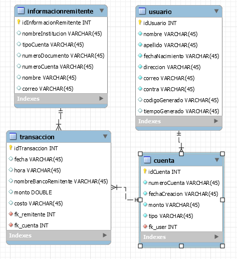
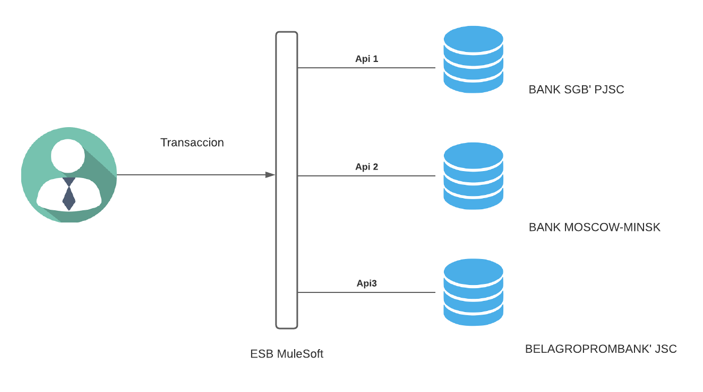
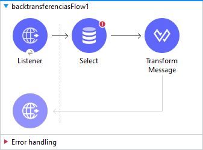
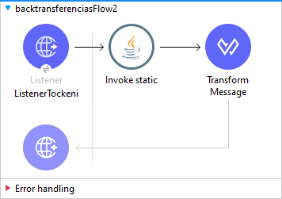
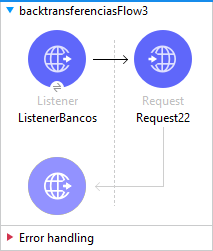
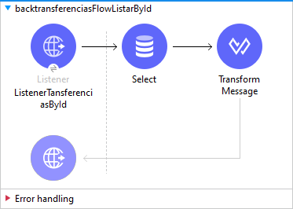
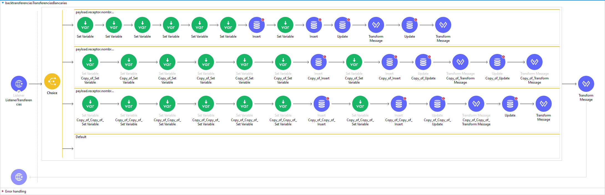

# TransferenciasInterbancarias
|  | VICERRECTORADO DOCENTE | Código: GUIA-PRL-001 |
| --- | --- | --- |
| CONSEJO ACADÉMICO | Aprobación: 2016/04/06 |
| Formato: Guía de Práctica de Laboratorio / Talleres / Centros de Simulación |

| F  ORMATO DE INFORME DE PRÁCTICA DE LABORATORIO / TALLERES / CENTROS DE SIMULACIÓN – PARA ESTUDIANTES |
| --- |
| CARRERA:COMPUTACION | ASIGNATURA: Sistemas Distribuidos |
| NRO. PRÁCTICA: | 30 | TÍTULO PRÁCTICA: 1 |
|

 |
| ACTIVIDADES DESARROLLADAS
Modelo Relacional de la base datos
 

Modelo Físico

 

En cuanto a la implementación a la implementación usamos como FrontEnd Ionic y como ESB mulesfot, el cliente hace las peticiones desde Ionic, según el banco que hayamos elegido para poder hacer la transacción interbancaria comunicará con las respectivas bases de datos usando como intermediario el ESB que nos ayuda a comunicarnos con las API&#39;s de los bancos, nosotros elegimos el banco usando la una API que esta en la nube esta nos proporciona el nombre de los bancos.

El primer Flow nos ayuda a obtener id del usuario usando el correo y la contraseña usando la siguiente sentencia:
 &quot;SELECT idUsuario FROM usuario where correo = :correo AND contra = :contra&quot;

 

Este servicio ayuda con la autenticación del usuario, cada vez que se inicie sesión el sistema enviará un código de verificación al correo electrónico en el cual el usuario tendrá 30 segundos para poder ingresar el código de verificación y así poder ingresar a su cuenta
 

Este servicio usa una api la cual nos proporciona los nombres de los bancos elegirlo y poder realizar una transacción.
 

Para poder mostrar el historial de transacciones hechas por el usuario se utiliza la siguiente sentencia:
 &quot;SELECT fecha, hora, monto, (Select info.nombreInstitucion FROM informacionremitente as info WHERE info.idInformacionRemitente = fk\_remitente) as nombreBanco, (Select info.numeroCuenta FROM informacionremitente as info WHERE info.idInformacionRemitente = fk\_remitente) as numeroCuenta, (Select info.tipoCuenta FROM informacionremitente as info WHERE info.idInformacionRemitente = fk\_remitente) as tipoCuenta , (Select info.nombre FROM informacionremitente as info WHERE info.idInformacionRemitente = fk\_remitente) as nombre, (Select info.numeroDocumento FROM informacionremitente as info WHERE info.idInformacionRemitente = fk\_remitente) as CI
FROM transaccion where fk\_cuenta = (Select idCuenta from cuenta where fk\_user=:idUser);&quot;
Lo que hace esta sentencia es que tomar elementos de dos tablas diferentes: &quot;información remitente&quot; y &quot;transaccion&quot; en cada SELECT extra que se puede observar obtiene los datos que queremos de la tabla &quot;información remitente&quot; cuyo id del usuario sea igual al que tenga en la tabla de transacción definimos un nombre para la salida del dato y como resultado final tenemos la información de las transacciones que ha hecho el usuario

 

En este Flow podemos observar los 3 servicios principales que sirven para poder hacer transacciones interbancarias cada uno es para un solo banco estos se comunican a través del choice que nos ofrece mulesoft, el choice es activado según el nombre del banco al que queramos hacer una transacción el proceso de la transacción es igual para los 3 bancos en la cual el funcionamiento es el siguiente:

1. Se guardan obtienen las variables que son enviadas que vienen por el front end estas son: monto, receptor(quien hace la transacción), fecha, hora, id del usuario y por último número de cuenta.
2. Se inserta la información del remitente.
3. Se obtiene la id de la operación anterior para poder hacer las siguientes operaciones
4. Se crea una nueva transacción
5. Se hace un update a la cuenta del remitente restando el monto de su saldo menos el monto de la transacción
6. Se realiza un update a la cuenta del banco adicionando el monto de la transacción
7. Finaliza el proceso

 

 |

|
 |
| --- |
|
 |

Nombre de estudiante: Bryam Guzman, Adrian Tena Christian Yunga

Firma de estudiante:

Formato aprobado con Res. C.S. N° 076-04-2016-04-20 Página 1 de 1
